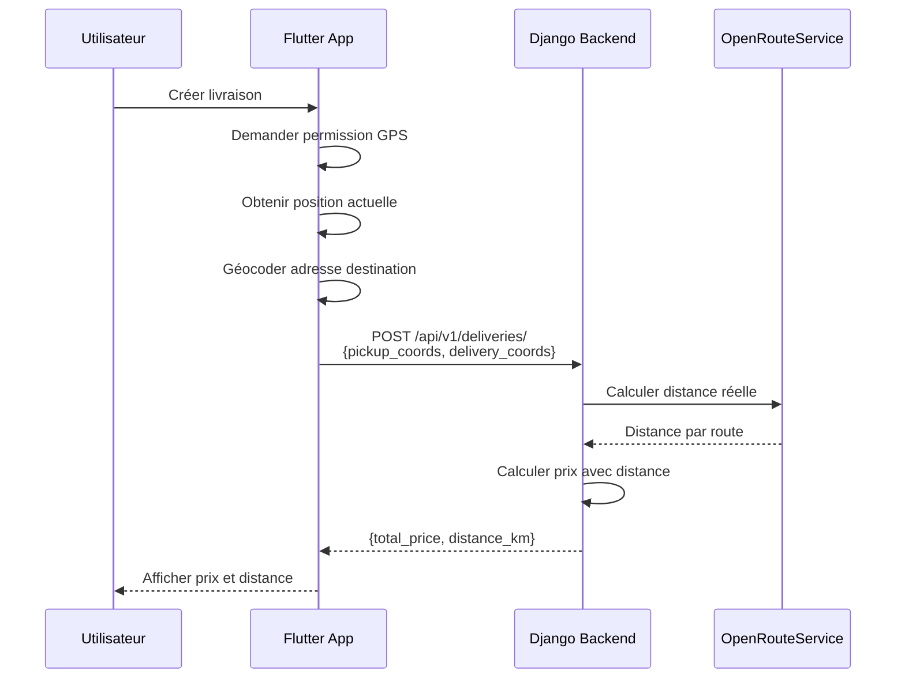

# 🗺️ Guide d'intégration de la géolocalisation

## 📋 Vue d'ensemble

Le backend LeBeni's utilise **OpenRouteService** (gratuit, sans carte bancaire) pour calculer les distances réelles entre les points de livraison.

**Fonctionnalités :**
- ✅ Calcul de distance par route (ou à vol d'oiseau si pas d'API)
- ✅ Fallback automatique sur formule haversine
- ✅ Geocoding : adresse → coordonnées GPS (optionnel)
- ✅ 100% gratuit (40 requêtes/minute)

---

## 🔧 Configuration Backend

### **Option A : Sans clé API (Mode haversine)**

Le système fonctionne **déjà** sans configuration :
- Utilise la formule haversine (distance à vol d'oiseau)
- Ajoute 20% pour approximer la distance par route
- **Suffisant pour démarrer le projet**

### **Option B : Avec OpenRouteService (Recommandé)**

Pour des distances plus précises (par route) :

1. **Créer un compte gratuit** : https://openrouteservice.org/dev/#/signup
2. **Obtenir une clé API** (gratuite, 40 req/min)
3. **Ajouter dans `.env`** :
   ```bash
   OPENROUTESERVICE_API_KEY=votre_clé_ici
   ```

**Aucune carte bancaire requise !** ✅

---

## 📱 Intégration Flutter

### **1. Obtenir la position GPS de l'utilisateur**

Installer les packages :
```yaml
# pubspec.yaml
dependencies:
  geolocator: ^11.0.0  # Géolocalisation
  geocoding: ^3.0.0    # Optionnel : adresse ↔ GPS
```

Code Flutter :
```dart
import 'package:geolocator/geolocator.dart';

// Demander la permission
Future<void> requestLocationPermission() async {
  LocationPermission permission = await Geolocator.checkPermission();
  
  if (permission == LocationPermission.denied) {
    permission = await Geolocator.requestPermission();
  }
  
  if (permission == LocationPermission.deniedForever) {
    // Rediriger vers les paramètres
    await Geolocator.openLocationSettings();
  }
}

// Obtenir la position actuelle
Future<Position?> getCurrentLocation() async {
  try {
    return await Geolocator.getCurrentPosition(
      desiredAccuracy: LocationAccuracy.high,
    );
  } catch (e) {
    print('Erreur géolocalisation: $e');
    return null;
  }
}
```

### **2. Envoyer les coordonnées au backend**

Lors de la création d'une livraison, inclure les coordonnées GPS :

```dart
Future<void> createDelivery() async {
  // Obtenir la position du marchand (pickup)
  Position? pickupPosition = await getCurrentLocation();
  
  // Obtenir la position de livraison (depuis l'adresse ou manuellement)
  // Ici, exemple avec géocodage d'adresse
  final deliveryCoords = await geocodeAddress("Yopougon, Abidjan");
  
  final deliveryData = {
    'pickup_commune': 'Cocody',
    'pickup_latitude': pickupPosition?.latitude,      // ← Ajouté
    'pickup_longitude': pickupPosition?.longitude,    // ← Ajouté
    
    'delivery_commune': 'Yopougon',
    'delivery_address': 'Yopougon, Marché Selmer',
    'delivery_latitude': deliveryCoords?.latitude,    // ← Ajouté
    'delivery_longitude': deliveryCoords?.longitude,  // ← Ajouté
    
    'package_weight_kg': 3.5,
    'is_fragile': false,
    'scheduling_type': 'immediate',
    
    // ... autres champs
  };
  
  // Envoyer au backend
  final response = await http.post(
    Uri.parse('$baseUrl/api/v1/deliveries/'),
    headers: {'Authorization': 'Bearer $token'},
    body: jsonEncode(deliveryData),
  );
}
```

### **3. Géocoder une adresse (adresse → GPS)**

```dart
import 'package:geocoding/geocoding.dart';

Future<Map<String, double>?> geocodeAddress(String address) async {
  try {
    List<Location> locations = await locationFromAddress(address);
    
    if (locations.isNotEmpty) {
      return {
        'latitude': locations.first.latitude,
        'longitude': locations.first.longitude,
      };
    }
  } catch (e) {
    print('Erreur geocoding: $e');
  }
  
  return null;
}

// Utilisation
final coords = await geocodeAddress("Yopougon, Abidjan");
print('Latitude: ${coords?['latitude']}');
print('Longitude: ${coords?['longitude']}');
```

### **4. Afficher une carte interactive (optionnel)**

Installer `google_maps_flutter` ou `flutter_map` :

```yaml
dependencies:
  google_maps_flutter: ^2.5.0  # Google Maps
  # OU
  flutter_map: ^6.0.0          # OpenStreetMap (gratuit)
```

Exemple avec Google Maps :
```dart
import 'package:google_maps_flutter/google_maps_flutter.dart';

GoogleMap(
  initialCameraPosition: CameraPosition(
    target: LatLng(5.3600, -4.0083), // Cocody
    zoom: 12,
  ),
  markers: {
    Marker(
      markerId: MarkerId('pickup'),
      position: LatLng(pickupLat, pickupLng),
      infoWindow: InfoWindow(title: 'Point de départ'),
    ),
    Marker(
      markerId: MarkerId('delivery'),
      position: LatLng(deliveryLat, deliveryLng),
      infoWindow: InfoWindow(title: 'Destination'),
    ),
  },
);
```

---

## 🔄 Flux complet



---

## 📊 Exemple de réponse backend

Quand tu envoies les coordonnées, le backend retourne :

```json
{
  "total_price": 7000.0,
  "breakdown": {
    "base_rate": 2500.0,
    "weight_surcharge": 150.0,
    "distance_surcharge": 2004.0,
    "subtotal": 4654.0,
    "multiplier": 1.5,
    "surcharge_details": ["Livraison immédiate +50%"]
  },
  "details": {
    "origin_zone": "Cocody",
    "destination_zone": "Yopougon",
    "distance_km": 10.02,           ← Distance calculée !
    "billable_weight_kg": 3.5
  }
}
```

---

## 🧪 Test depuis Flutter

Exemple de test manuel :

```dart
// Test avec coordonnées fixes
final testData = {
  'pickup_commune': 'Cocody',
  'pickup_latitude': 5.3600,
  'pickup_longitude': -4.0083,
  
  'delivery_commune': 'Yopougon',
  'delivery_latitude': 5.2893,
  'delivery_longitude': -3.9828,
  
  'package_weight_kg': 3.5,
  'scheduling_type': 'immediate',
};

// Devrait retourner ~10 km de distance
```

---

## 🚀 Prochaines étapes

### **Backend (Déjà fait ✅)**
- ✅ Service `LocationService` créé
- ✅ Intégration dans `PricingCalculator`
- ✅ Champs GPS dans modèle `Delivery`
- ✅ Tests passés

### **Flutter (À faire)**
1. **Ajouter les packages** : `geolocator`, `geocoding`
2. **Demander permission GPS** au démarrage
3. **Modifier le formulaire de livraison** pour inclure les coordonnées
4. **Afficher la distance calculée** avant confirmation
5. **[Optionnel] Carte interactive** pour sélectionner l'adresse

---

## 💰 Coûts

| Service | Gratuit | Limite | Carte bancaire |
|---------|---------|--------|----------------|
| **Haversine (formule)** | ✅ Oui | Illimité | ❌ Non |
| **OpenRouteService** | ✅ Oui | 40 req/min | ❌ Non |
| **Google Maps API** | ⚠️ 200$/mois | 40k req/mois | ✅ Oui (requis) |

**Recommandation** : Démarrer avec **haversine** (déjà fonctionnel), puis ajouter OpenRouteService si besoin de précision.

---

## ❓ FAQ

**Q: La distance est-elle précise sans OpenRouteService ?**  
A: La formule haversine + 20% donne une bonne approximation (~90% de précision).

**Q: Peut-on utiliser Google Maps ?**  
A: Oui, mais nécessite une carte bancaire. Voir `apps/core/location_service.py` pour adapter.

**Q: Comment tester le système ?**  
A: Lance `python test_location_service.py` depuis le backend.

**Q: Que se passe-t-il si l'utilisateur refuse la géolocalisation ?**  
A: Le backend utilise une distance par défaut de 10 km. Encourage l'utilisateur à activer le GPS.

---

## 📞 Support

Besoin d'aide ? Consulte :
- Documentation OpenRouteService : https://openrouteservice.org/dev/#/api-docs
- Package Flutter Geolocator : https://pub.dev/packages/geolocator
- Code source : `backend/apps/core/location_service.py`

---

✅ **Système opérationnel** - Prêt pour l'intégration Flutter ! 🚀
